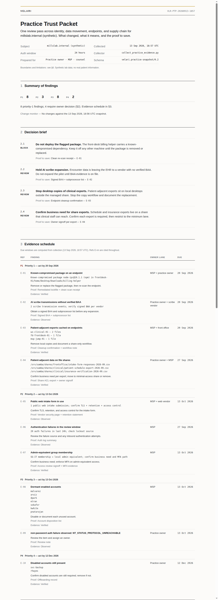

# Practice Trust Lab

[](https://github.com/itsnmills/practice-trust-lab/actions/workflows/ci.yml)

**A synthetic small-clinic environment that produces real, dated, no-PHI security evidence.**

The lab stands up a fake medical practice — Active Directory domain, domain-joined
endpoints, clinical file shares, a mock EHR with AI-scribe egress — and an evidence
pipeline that turns it into a client-ready review packet. Findings are genuine
detections; every patient, vendor, and record is synthetic by design.

This exists because healthcare security problems are easy to describe and hard to
prove, and real clinics are off-limits for portfolio work. So the environment is
built instead.



## What it demonstrates

- **Identity and access:** Samba AD domain with AGDLP group nesting, least-privilege
  share ACLs, lockout policy, dormant-account review
- **Patient data outside the EHR:** clinical exports on shares and cached on endpoint
  desktops, proven by SHA-256 equality between the two
- **AI scribe risk:** simulated transmissions to vendors with unverified BAA status
- **Supply chain:** package-exposure scan (optional Bumblebee integration) catches a
  planted shadow-IT app pinned to a known-compromised npm release
- **Drift detection:** each run diffs against the previous snapshot — new/resolved
  findings, account and group changes, file-hash changes, endpoint copy changes
- **Evidence packaging:** decision brief, evidence schedule with stable refs,
  reviewer lanes, change monitor, limitations and attestation — print-grade output

## Architecture

```
Samba AD DC (millslab.internal)                     clinic-ehr (mock EHR, :8095)
├── OUs / AGDLP groups / lockout policy             ├── synthetic patient roster
└── File shares with AD-group ACLs                  ├── public web intake form
    ├── ClinicalShare    (schedules, insurance)     └── AI-scribe egress simulation
    ├── FrontOfficeShare (intake responses)
    └── ITShare          (admin runbooks)

Endpoints (all domain-joined)
├── ws-clinical-01  syncs clinical exports to a local desktop
├── fd-frontdesk-01 carries a planted shadow-IT app (compromised dependency demo)
└── msp-jump-01     outsourced-MSP admin box with IT + front-office access

evidence/collect_practice_evidence.py   read-only pass -> JSON/Markdown snapshot
evidence/render_practice_snapshot.py    snapshot -> client-facing HTML packet
```

Everything runs in Docker on your own machine. Published ports bind to `127.0.0.1`
by default (`LAB_BIND_IP` in `samba-dc/.env` if you want a VPN interface).

## Quickstart

Requirements: Linux with Docker Compose v2, Python 3.10+, and `openssl`
(tested on Ubuntu 24.04).

```bash
git clone https://github.com/itsnmills/practice-trust-lab.git && cd practice-trust-lab
./scripts/bootstrap.sh        # network, volume, credentials, domain, shares, endpoints
./scripts/seed-scenario.sh    # plant the shadow-IT app (supply-chain demo)
./scripts/run-evidence.sh     # collect a snapshot and render the packet
```

Open `evidence/latest.html`. A pre-rendered example lives at
[`examples/sample-packet.html`](examples/sample-packet.html).

To tear the lab down:

```bash
for d in workstation-01 frontdesk-01 msp-jump-01 clinic-ehr samba-dc; do
  (cd "$d" && docker compose down -v)
done
docker network rm mills-lab
docker volume rm mills-lab-shares
```

Generated runtime files (`samba-dc/.env`, `*/home`, `*/logs`, `clinic-ehr/data`)
are left in place; delete them for a pristine tree.

## The evidence pass

One read-only pass collects:

| Section | Signals |
|---|---|
| Identity | users, enabled/disabled, never-logged-on, stale, password/lockout policy, privileged groups |
| Shares | file inventory with SHA-256 prefixes, patient-adjacent detection |
| Authentication | parsed domain auth audit, success/failure counts, failure reasons |
| EHR surface | portal health, intake submissions, scribe transmission events |
| Endpoints | local copies per endpoint, hash-matched against share files |
| Supply chain | package-exposure findings (optional: requires a configured scanner) |

Output per run: `evidence/artifacts/<date>/snapshot-*.json` + `.md` + `.html`,
plus one hash-ledger line in `evidence/ledger.jsonl`. Each snapshot carries a
**change monitor** diffed against the previous run.

The supply-chain section uses [Bumblebee](https://github.com/perplexityai/bumblebee)
(Apache-2.0). Point `BUMBLEBEE_DIR` at a checkout with `bin/bumblebee` and exposure
catalogs; without it, the section is skipped cleanly.

## Design decisions

- **Metadata only.** The collector reads policy, group membership, counts, and
  hashes. It never extracts patient content, credentials, or message bodies.
- **Read-only by contract.** The evidence pass does not remediate; it produces
  asks with proof-to-save for the owner lane.
- **Negative tests are part of the demo.** Clinical users can read `ClinicalShare`;
  IT is denied there but allowed `ITShare`; temporary-password users cannot
  authenticate. Those boundaries are verified, not assumed.
- **Synthetic boundary.** `millslab.internal`, its users, and its patients exist
  only in this lab. Nothing here is a compliance certification, legal advice, or
  a breach determination.

## Repo layout

```
samba-dc/          AD DC image, domain population, share provisioning, compose
clinic-ehr/        mock EHR app (Python stdlib) + compose
endpoint/          shared domain-joined endpoint image (env-configured)
workstation-01/    clinical endpoint compose + local data
frontdesk-01/      front office endpoint compose + local data
msp-jump-01/       MSP admin endpoint compose + local data
evidence/          collector + packet renderer
scripts/           bootstrap, scenario seed, evidence runner
examples/          sanitized sample snapshot + rendered packet
docs/              screenshot assets
```

## License

MIT. The Bumblebee scanner and its catalogs are separate projects under their own
licenses and are not vendored here.
